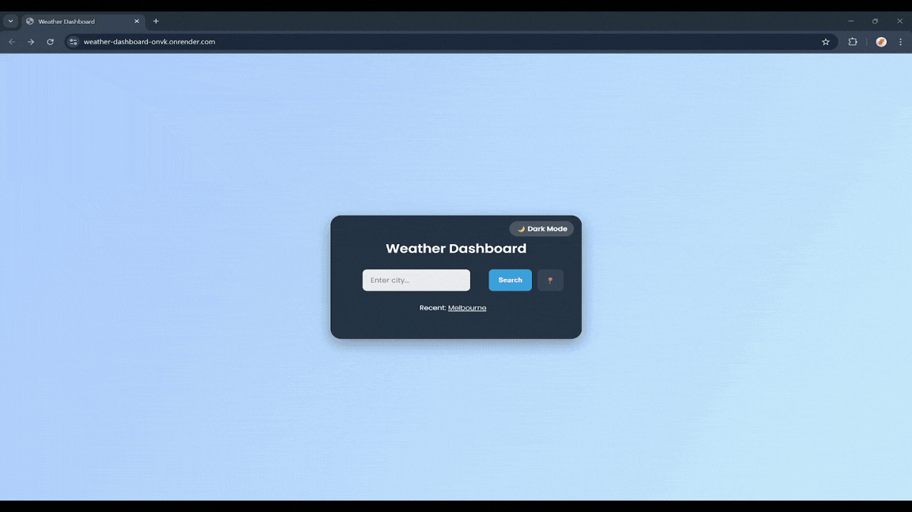
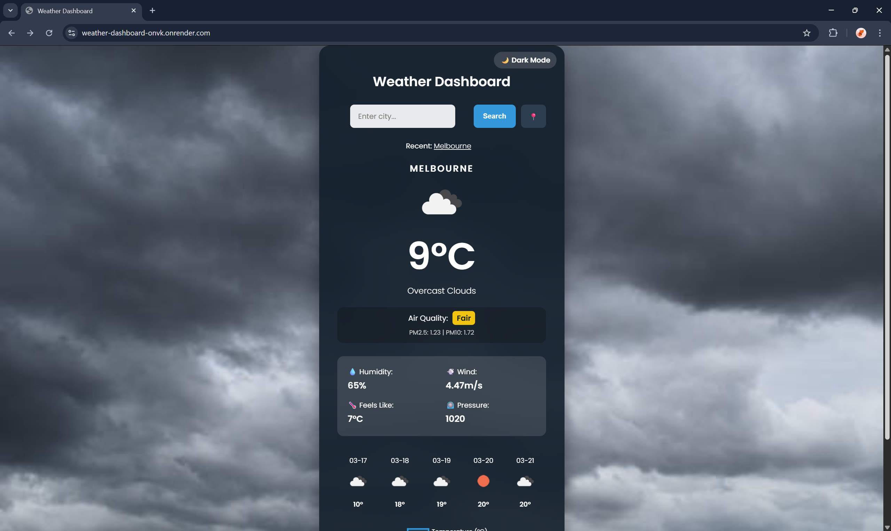
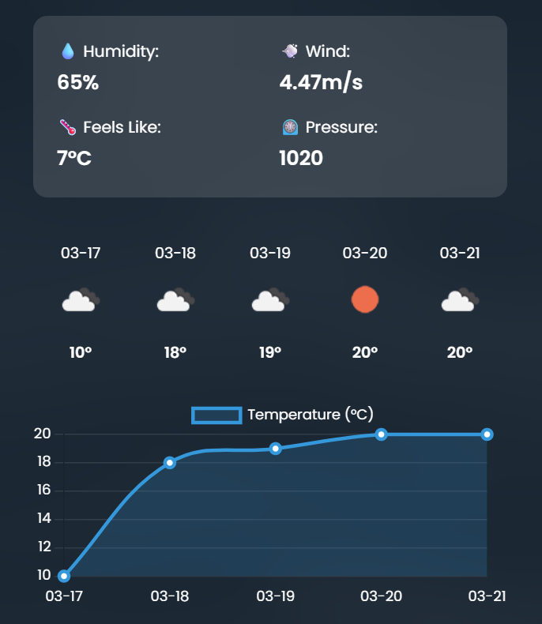
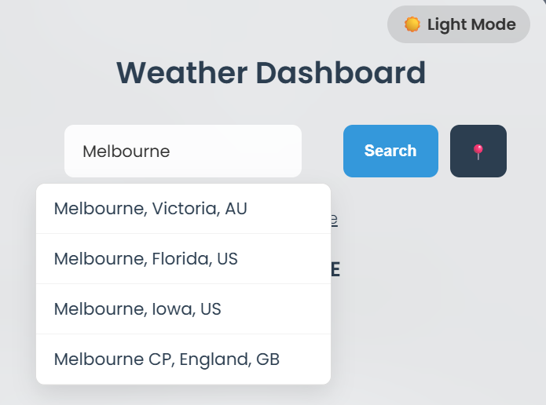

# 🚀 API-Driven Weather Dashboard


A full-stack, cloud-deployed weather app that fetches real-time data, air quality, and forecasts using external APIs and local database persistence.

---

## 🎥 Live Demo

**🌍 [View Live Weather Dashboard Here](https://weather-dashboard-onvk.onrender.com)**

*(Note: As this is hosted on a free cloud tier, the server may take ~50 seconds to wake up from sleep mode on the first click).*



---

## ⚠️ API Integration & Performance Handling
This project relies on the OpenWeatherMap API suite (Current Weather, 5-Day Forecast, Air Pollution, and Geocoding). To ensure optimal performance and prevent API rate-limiting, the backend handles API failures using try/except blocks, and the frontend implements 300ms debouncing to reduce API calls. 

---

## 🚀 Features

- **Live Environmental Metrics:** Displays real-time temperature, humidity, wind speed and localized Air Quality Index (AQI) with PM2.5/PM10 breakdowns.
- **Interactive Data Visualization:** 5-day temperature forecasting rendered dynamically via curved, responsive `Chart.js` line graphs.
- **Autocomplete Search:** Asynchronous city suggestions using the OWM Geocoding API with 300ms debouncing to reduce API calls.
- **Persistent Search History:** Local `SQLite3` database integration that securely saves and displays recent successful queries for one-click access.
- **Weather-Responsive UI:** Photographic backgrounds that change based on current API conditions, paired with a persistent Dark/Light mode toggle (saved via browser `localStorage`).
- **Error Handling:** Handles invalid cities, API failures (404/401), and network timeouts with clear user feedback.

---

## 🎯 What I Worked On

* **Backend Architecture:** MVC design pattern, Python/Flask routing, and SQLite database persistence.
* **API Engineering:** RESTful API integration, JSON payload parsing, and asynchronous JavaScript fetching.
* **DevOps & Containerization:** Writing production-grade Dockerfiles, port binding, and cloud deployment via Render.
* **Frontend Development:** Responsive UI design, glassmorphism CSS, DOM manipulation, and data visualization using Chart.js.
* **Error Handling:** Managing HTTP 404s/401s and network timeouts with try/except blocks and UI fallback states.

---

## 🛠 Tech Stack

**Frontend**
- HTML5 / CSS3 (Glassmorphism & Flat UI dashboard styling)
- Vanilla JavaScript (ES6)
- Chart.js (Interactive line graphs)

**Backend**
- Python 3.11+
- Flask (Lightweight routing and controller logic)
- SQLite3 (Local database for search history)

**APIs / DevOps**
- OpenWeatherMap API Suite
- `requests` (Synchronous HTTP requests)
- `pytest` (Automated unit testing)
- Docker (Containerized deployment)

---

## 📸 Screenshots

### 1. Dynamic Dashboard & AQI
*(Featuring weather-specific backgrounds and real-time air quality badging)*


### 2. Interactive Data Visualization
*(Responsive 5-day forecast plotted with Chart.js)*


### 3. Autocomplete & Light Mode
*(300ms debouncing to reduce API calls with frosted-glass light mode UI)*


---

## ⚙️ How It Works

1. **Input:** User types a location. The frontend sends debounced requests to the Geocoding API to suggest matching global cities.
2. **Routing:** Upon submission, the Flask controller routes the city name (or Geolocation coordinates) to the Python service layer.
3. **Data Fetching:** `weather_service.py` sends requests to OpenWeatherMap APIs to fetch current weather, a 5-day forecast list, and localized air pollution data.
4. **Persistence:** If the API call is successful (HTTP 200), the city is saved to the local `SQLite` database.
5. **Exception Handling:** If the city is invalid or the network drops, specific HTTP errors are caught using try/except and parsed into readable UI alerts.
6. **Output:** The Flask controller passes the consolidated JSON payload to the Jinja template, triggering `Chart.js` to draw the graph and the CSS to update the dynamic background.

---

## 🧠 System Architecture

This application adheres to a modular **Model-View-Controller (MVC)** architecture to separate routing, logic, and presentation:

* **Service Layer (`weather_service.py`):** Handles all external API communication, JSON parsing, dictionary mapping, and strict network exception handling.
* **Controller (`app.py`):** A Flask router that manages `GET`/`POST` requests, environment variables, and local SQLite database queries. 
* **View (`index.html`):** A highly responsive frontend utilizing Jinja2 templating, dynamic CSS classes, and JavaScript for chart rendering and theme management.

---

## 💡 Challenges & Solutions

- Implementing 300ms frontend debouncing to reduce API load and improve UX.
- Handling API rate limits and network failures gracefully using try/except.
- Designing a modular service layer for scalable API integration.
- Persisting user search history using SQLite without compromising performance.

---

## 💻 Local Installation
1. Clone the repository and create a virtual environment:
    ```bash
    git clone https://github.com/AayushWaney/weather-dashboard.git
    cd weather-dashboard
    python -m venv venv
    source venv/bin/activate  # On Windows use `venv\Scripts\activate`
    ```
   2. Install the required dependencies:
       ```bash
       pip install -r requirements.txt
       ```
3. Set up your Environment Variables:
Create a `.env` file in the root directory and add your OpenWeatherMap API key:
    ```bash
    API_KEY=openweathermap_api_key_here
    ```
4. Boot the Flask Server:
    ```bash
    python app.py
    ```
5. Access the dashboard at:
    ```bash
    http://127.0.0.1:5000
    ```
*(Optional) To run the automated unit tests, execute `pytest test_weather_service.py` in your terminal.*

---

## 🔮 Future Improvements
* Implement user authentication (OAuth) for personalized weather alert subscriptions.
* Integrate interactive precipitation radar mapping using Leaflet.js.

---

## 📁 Project Structure
```text
weather-dashboard/
│
├── app.py                      # Flask application and DB controller
├── requirements.txt            # Python dependencies
├── Dockerfile                  # Containerization instructions
├── .env                        # Local environment variables
│
├── services/                   
│   ├── __init__.py
│   └── weather_service.py      # External API & Error Handling logic
│
├── tests/
│   └── test_weather_service.py # Pytest unit testing suite
│
├── templates/                  
│   └── index.html              # Main dashboard view
│
├── static/                     
│   ├── style.css               # UI Styling & Theming
│   └── images/                 # Dynamic photographic backgrounds
│
└── screenshots/                # Images and Demo GIF used in README
```
---
## 👨‍💻 Author
Aayush Waney  
B.Tech – Metallurgical Engineering  
VNIT Nagpur

GitHub: https://github.com/AayushWaney

---

 ## 📄 License
This project is released for educational and portfolio purposes.

---